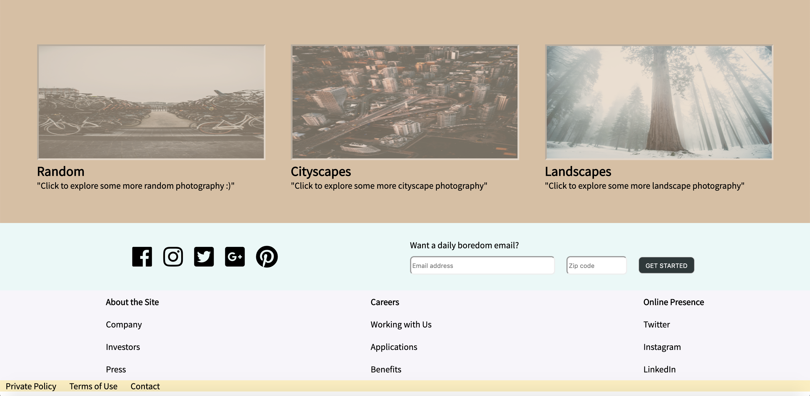

### Frances Cohen
### Lab 1: Landing Page
### CS 52 Spring 2019

## Description
For this project, I created a home page for an imaginary "boredom" page, which is essentially a random collection of links to entertaining activities on the internet! For my landing page, I did not mimick one particular website, but rather pulled elements I liked from several, particularly flourbakery.com, starbucks.com, and figma.com. I followed the general format of several large panels with different backgrounds that are vertically stacked (this format is present in all 3 websites I was mimicking). The top panel is inspired by flourbakery.com and has a resizing background image (I made the design choice to only shrink it down to a certain point) and a call-to-action button inspired by the "float away" button on Starbucks home page. The top menu with unerlining hover effects, which also turns to an expanding hamburger menu when compressed is inspired by flourbakery's menu. The three colored panels below are inspired by Figma's panels (3 images with text below each and header text for the overall panel), and I mimicked the layout using nested flex boxes. The format turns vertical (just as Figma's does) when compressed. The bottom panels (one with social media icons and email signup and one with footer links) are inspired by Starbucks' footer. The bottom menu shrinks own to a vertical menu with expanding menu items when the browser is compressed. I included several other responsive layout design features for the compressed browser view.

## Layout Phase Screen Caps

## Other Screen Caps

### Dropdown menus in compressed mode:

### Hover effects and stylized buttons:

### Responsive compressed/mobile design:

## URL's to mimicked websites:
* https://flourbakery.com/
* https://www.starbucks.com/
* https://www.figma.com/